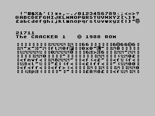
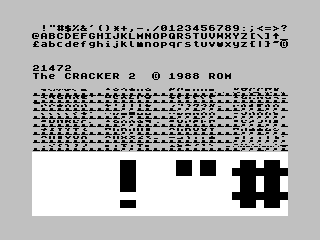

# The CRACKER

The CRACKER are two tiny tools for the ZX Spectrum that I wrote in 1988. They can be used for scanning files for bitmaps, fonts and texts. They also contain a simple text or font editor, so binaries can be manipulated on the fly.

* _The CRACKER 1_: Search for texts and fonts, and edit texts.
* _The CRACKER 2_: Search for bitmaps and fonts, and edit fonts.

The tools are so tiny that they fit into the screen memory, giving you up to 42240 bytes of free memory.

## The CRACKER 1

 This is the text cracker.

The topmost three rows show the character set visible at the current address. The current address is shown below that, followed by a copyright note.

The center of the screen shows the text at the current address. Small numbers 0 to 31 represent control characters. Inverted characters represent the normal character, but with bit 8 set. Setting bit 8 in a text was often used to terminate a string.

You can control _The CRACKER 1_ with the following keys:

* 1: Reset address to the start of the empty memory area.
* 2: Store current address in store 1.
* 3: Recall address from store 1.
* 4: Store current address in store 2.
* 5: Recall address from store 2.
* 0: Edit the text in the text area.
* Q, A: Move address by 1 byte.
* W, S: Move address by 8 bytes (a character).
* E, D: Move address by 32 bytes (a text block).
* R, F: Move address by 768 bytes (a character set).
* T, G: Move address by 2048 bytes (a third of a screen).
* P: Save 768 bytes (a character set) to a headerless file, starting from the current address.
* O: Save 2048 bytes (a third of a screen) to a headerless file, starting from the current address.
* I: Save 6144 bytes (a screen bitmap without colour attributes) to a headerless file, starting from the current address.
* U: Save 6912 bytes (a screen bitmap with colour attributes) to a headerless file, starting from the current address.
* Y: On first press, mark starting position. On second press, save data from starting position to current position to a headerless file.
* H, J, K, L, Enter: Load a headerless file to the current position. If you want to load a standard file, skip the header.

After you started the editor by pressing "0", you can control it by these keys (using Caps Shift or Symbol Shift where necessary):

* Cursor keys: Move cursor in the direction.
* Inv. Video (Caps 4): Move cursor to next block of characters.
* True Video (Caps 5): Move cursor to previous block of characters.
* Enter: Leave editor, go back to scan mode.
* Delete: Invert bit 8 of current character.
* &lt;&gt;: Input control character 31. This enables you to input control characters as well.
* &lt;=: Select previous character or control character.
* &gt;=: Select next character or control character.

All other keys are typed into the text area.

## The CRACKER 2

 This is the bitmap and font cracker.

The topmost three rows show the character set visible at the current address. The current address is shown below that, followed by a copyright note.

The center of the screen shows the bitmap at the current address.

The bottom part of the screen shows the magnification of the first four characters. This is also the editor area.

You can control _The CRACKER 2_ with the following keys:

* 1: Reset address to the start of the empty memory area.
* 2: Store current address in store 1.
* 3: Recall address from store 1.
* 4: Store current address in store 2.
* 5: Recall address from store 2.
* 0: Edit the characters in the editor area.
* Q, A: Move address by 1 byte.
* W, S: Move address by 8 bytes (a character).
* E, D: Move address by 256 bytes (a row of characters).
* R, F: Move address by 1024 bytes.
* T, G: Move address by 2048 bytes (a third of a screen).
* P: Save 768 bytes (a character set) to a headerless file, starting from the current address.
* O: Save 2048 bytes (a third of a screen) to a headerless file, starting from the current address.
* I: Save 6144 bytes (a screen bitmap without colour attributes) to a headerless file, starting from the current address.
* U: Save 6912 bytes (a screen bitmap with colour attributes) to a headerless file, starting from the current address.
* Y: On first press, mark starting position. On second press, save data from starting position to current position to a headerless file.
* H, J, K, L, Enter: Load a headerless file to the current position. If you want to load a standard file, skip the header.

After you started the editor by pressing "0", you can control it by these keys:

* Q, A, O, P: Move cursor up, down, left, right.
* M: Invert pixel.
* N: Set pixel.
* Symbol Shift: Reset pixel.
* Space: Leave editor.
* Caps Shift: Mirror character on the X axis.
* Z: Mirror character on the Y axis.
* X: Copy character to clipboard.
* C: Paste character from clipboard.
* V: Clear character.
* B: Invert character.

## Development

The original source code was for the _SYS_ assembler by Individual Software (Michael Stramm). I have ported it to a modern environment. It can now be built using [zasm](http://k1.spdns.de/Develop/Projects/zasm/) and [ant](http://ant.apache.org/). The result is a Snapshot file that can be run on any ZX Spectrum emulator.

If you would like to contribute:

* Fork the [Source code at GitHub](https://github.com/shred/cracker). Feel free to send pull requests.
* Found a bug? [File a bug report!](https://github.com/shred/cracker/issues)

## License

The CRACKER is open source software. The source code is distributed under the terms of [GNU General Public License (GPLv3)](https://www.gnu.org/licenses/gpl-3.0.en.html#content).
